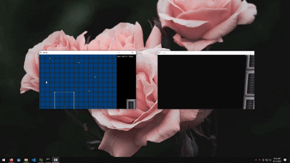

# ZeroG
This is an FPS engine that I made as a way of learning **OpenGL**. Since I was inspiried by old-school shooters, I went with an intentionally retro style, using a low internal resolution, disabled texture filtering, and billboard sprites for enemies.

The way **level geometry** is generated is inspired by the concept of "sectors" from the Doom map editor. Each sector is defined by a floor height, a ceiling height, and a series of verticies in XZ space. For every edge between the vertices, two triangles are created to form the walls. The ceiling and floor triangles are generated by making a polygon out of the vertices and then breaking that polygon up into triangles. The game then **generates vertex normals and texture coordinates** for the generated triangles before buffering them into the sector's vertex buffer.

The game implements **frustum culling** so that only sectors that are visible within the camera frustum are rendered.

Since the game is a zero-gravity shooter, players can move and rotate in any direction. I use an **orthonormal basis vector** to keep track of their rotation.

The game has billboard sprite **enemies** with a basic **AI**. They can "see" and follow the player, and they're smart enough to navigate around walls. They also use **flocking behavior** to avoid bumping into each other.

A **post-process shader** is used for the player hurt and death animations.

I also made a **level editor** to make it easier to create map files. When run in edit mode, the game opens two windows, The editor window on the left uses a plain SDL software renderer, and the preview window on the right uses the game's rendering code (with lighting disabled) to allow users to preview the level as they're building it.

Note that the art assets used are not mine. Some of them are ripped from old video games. These assets are used as placeholder art, and this project is meant for my own learning purposes only.
